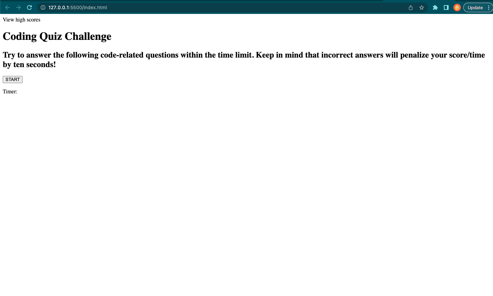
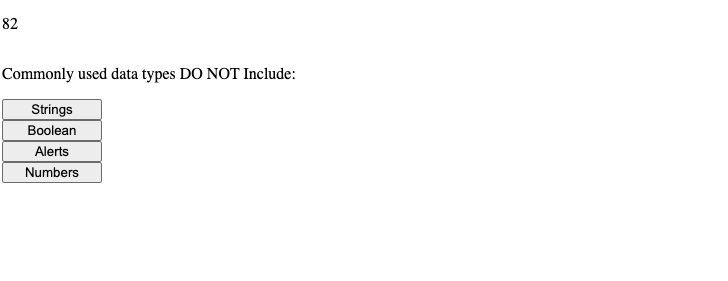

# How Well Do You Know JavaScript? Code Quiz 4

## Description
This code quiz is a timed coding quiz with multiple-choice questions that runs in the browser and powered to be dynamic with JavaScript.  

The motivation for this project was to simulate what it may be like in an interview situation where you would be asked to complete a coding assessment.  Therefore, this application provides the change to apply skills learned in JavaScript.  

This code quiz was built to not only apply our skills in JavaScript, but also create the app and test our knowledge simultaneously as the quiz asks questions about JavaScript.  Together, while building the quiz and answering the questions that are part of the quiz, our knowledge of JavaScript continues is on display coneceptually and technically.  

The problem that this app solves is that it helps the user to practice their JavasScript knowledge in case they are asked these questions in the interview process.  

## Installation
N/A

## Usage
In the browser click the start button to begin the quiz. 

This also starts the timer that subtracts 10 seconds from the running time if a question is answered incorrectly. 

Once the question is answered another question is presented.  After all questions are answered or the timer reachers zero, the game is over and you are able to see your score and save it by entering your initials.  

This should take you to a high scores page where you can see other players scores in comparison.  

## Credits
I'd like to give special thanks to my instructor Bryan Swarthout for helping me get started with this project, my TA Shawn Tschoepe for advice and encouragement and Ryan Fernandez for tutoring me to get the timer working.  

## License
N/A

## Questions
If you have any questions, please feel free to contact me at pkfalberto@gmail.com.  

